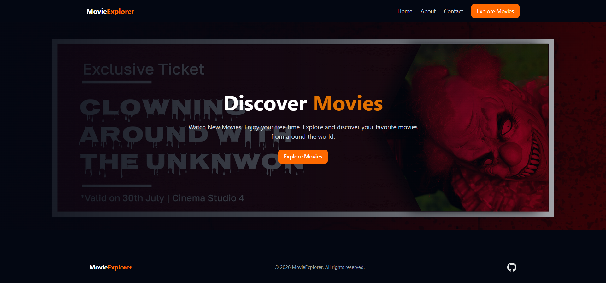

# 🎬 Movie Explorer

A modern and responsive **Movie Explorer Web Application** built with **React** and the **TVMaze API**. Users can browse movies/shows, search by title, and view detailed information through an interactive modal.

## 🌐 Live Preview

<p align="center">
  
</p>

---

## 🌐 Live Demo

🔗 Live Website:[Vercel Live Link](https://movie-explorer-opal-one.vercel.app/) `YOUR_LIVE_LINK`

## 📂 Repository

🔗 GitHub Repository:[Movie-Explore](https://github.com/jessicarozario22/Movie-Explore/) `YOUR_GITHUB_REPO_LINK`

---

## ✨ Features

* 🏠 Modern responsive Home Page
* 🎬 Browse movies and TV shows
* 🔎 Search shows by title
* ⭐ Display ratings
* 📅 Display release year
* 🎭 Display genres
* 📖 Interactive movie details modal
* 📱 Fully responsive design
* ⚡ API-based dynamic data
* ❌ Loading and error handling

---

## 🏠 Home Page

The landing page includes:

* Application logo and navigation
* Cinematic hero banner
* Application introduction
* **Explore Now** CTA
* Responsive footer

---

## 🎬 Movie Listing Page

Users can browse available shows and search for specific titles.

### Movie Cards Include

* Movie/show poster
* Title
* Rating
* Release year
* Genre
* **See Details** button

---

## 🔎 Search Functionality

Users can search for movies or shows by title.

```text
Search → TVMaze API → Results → Movie Grid
```

### Search API

```text
https://api.tvmaze.com/search/shows?q={query}
```

Example:

```text
https://api.tvmaze.com/search/shows?q=girls
```

---

## 📖 Movie Details Modal

Clicking **See Details** opens an interactive modal containing:

* Large poster
* Movie/show title
* Rating
* Release date
* Genres
* Summary
* Additional information
* Close button

---

## 🌐 API Integration

This project uses the free **TVMaze API**.

### Get All Shows

```text
https://api.tvmaze.com/shows
```

### Search Shows

```text
https://api.tvmaze.com/search/shows?q={query}
```

📚 **API Documentation:**
https://www.tvmaze.com/api

---

## 🛠️ Technology Stack

| Technology   | Purpose                  |
| ------------ | ------------------------ |
| React        | Frontend UI              |
| JavaScript   | Application Logic        |
| CSS          | Styling                  |
| TVMaze API   | Movie/Show Data          |
| Vite         | Development & Build Tool |
| Git & GitHub | Version Control          |

---

## 📁 Project Structure

```text
movie-explorer/
│
├── public/
│   └── movie-explorer-preview.png
│
├── src/
│   ├── components/
│   │   ├── Navbar.jsx
│   │   ├── Hero.jsx
│   │   ├── Footer.jsx
│   │   ├── SearchBar.jsx
│   │   ├── MovieCard.jsx
│   │   └── MovieModal.jsx
│   │
│   ├── pages/
│   │   ├── Home.jsx
│   │   └── Movies.jsx
│   │
│   ├── App.jsx
│   ├── main.jsx
│   └── index.css
│
├── package.json
└── README.md
```

---

## 🚀 Getting Started

### Clone the repository

```bash
git clone YOUR_GITHUB_REPO_LINK
```

### Go to the project directory

```bash
cd movie-explorer
```

### Install dependencies

```bash
npm install
```

### Run the development server

```bash
npm run dev
```

---

## 📱 Responsive Design

The application is optimized for different screen sizes:

| Device      | Layout     |
| ----------- | ---------- |
| 📱 Mobile   | 1 Column   |
| 📲 Tablet   | 2 Columns  |
| 💻 Medium   | 3 Columns  |
| 🖥️ Desktop | 4+ Columns |

---

## 🎨 Design

The UI follows a modern cinematic design direction:

* 🌑 Dark theme
* 🟠 Orange accent color
* 🎞️ Movie-focused visuals
* 💎 Modern card design
* 🔲 Rounded components
* 📱 Mobile-first responsive layout
* ✨ Interactive modal experience

---

## 🧩 React Concepts Used

This project demonstrates practical use of:

* React Components
* Props
* `useState`
* `useEffect`
* API Fetching
* Conditional Rendering
* Event Handling
* Array `.map()`
* Dynamic UI Rendering
* Search Functionality
* Modal Interaction
* Responsive Design

---

## 🎯 Assignment Requirements

* [x] Home Page
* [x] Navbar
* [x] Hero Banner
* [x] Footer
* [x] Movie Listing Page
* [x] Search Functionality
* [x] TVMaze API Integration
* [x] Responsive Movie Grid
* [x] Movie Cards
* [x] Movie Poster
* [x] Movie Title
* [x] Release Year
* [x] Rating
* [x] See Details Button
* [x] Details Modal
* [x] Responsive Mobile Design
* [x] Desktop Grid Layout

---

## 📸 UI Preview

<p align="center">
  
</p>

---

## 🔮 Future Improvements

* ⭐ Favorite movies
* 🔖 Watchlist
* 🎭 Genre filtering
* 📄 Pagination
* 🔍 Advanced search
* ↕️ Sorting
* 🎞️ Trailer integration
* 🌙 Theme switching
* 🔐 User authentication

---

## 👩‍💻 Developer

### Jessica Mary Rozario

**UI/UX Designer & Web Developer**

* GitHub: `YOUR_GITHUB_LINK`
* LinkedIn: `YOUR_LINKEDIN_LINK`
* Behance: `YOUR_BEHANCE_LINK`

---

## 📄 License

This project was created for educational and portfolio purposes.

Movie/show data is provided by the **TVMaze API**.

---

⭐ **If you like this project, consider giving the repository a star!**
